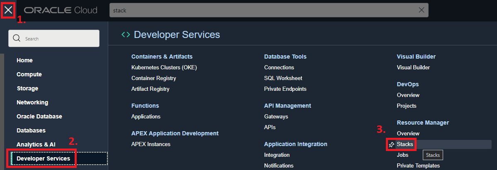
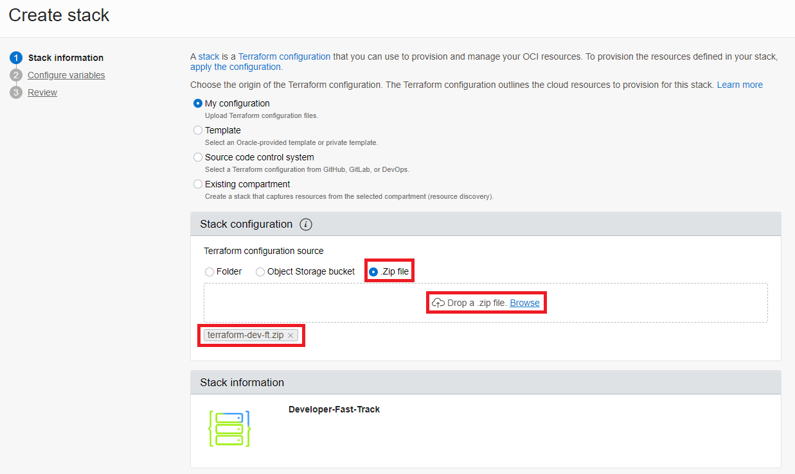
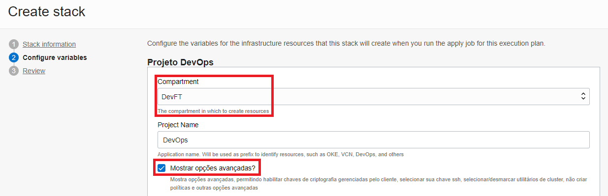

# Lab. 1 - Resource Provisioning  

In this step, you will provision resources within the OCI Console using Terraform with the service **Resource Manager**!

- 🌀 [Resource Manager official page](https://www.oracle.com/devops/resource-manager/)
- 🧾 [Resource Manager Documentation](https://docs.oracle.com/en-us/iaas/Content/ResourceManager/home.htm)

The resources provisioned will be:

- OKE
- Artifact Registry
- Container Registry
- OCI DevOps
- APM
- API Gateway
- Streaming
- Object Storage
- Functions

Along with Network and Management features such as:

- VCN
- Subnets
- Dynamic Groups
- Policies
- Compartments

- - -

## Pre-Reqs - Creating a compartment
As a prerequisite, it's a good idea to create an isolated compartment so that we can group our resources together!

1. To do this, do the [login](https://www.oracle.com/cloud/sign-in.html) in your OCI account.

2. In the 🍔 hamburger menu, go to: **Identity & Security** → **Identity** → **Compartments**.

3. In the new window, click on **Create Compartment**.

4. Enter a name for the compartment and also a description. Once this is done, click on **Create Compartment**.

Excellent!!! We can now start with our lab steps!

- - -

## Step 1 - Download the repository

The first step is to download the file (zip) from the github repository.

 1. To do this, go to the [repository](https://github.com/CeInnovationTeam/terraform-dev-ft) and click on **Download ZIP**.
  

- - -

## Step 2 - Uploading the terraform to the Resource Manager

1. Do the [login](https://www.oracle.com/cloud/sign-in.html) in your OCI account.

2. In the 🍔 hamburger menu, go to: **Developer Services** → **Resource Manager** → **Stacks**.

3. In this new window, access the previously created compartment and click on **Create Stack**.

4. Select the "Zip file" option, click on "browse" and drag the archive (.zip) containing the .tf files. Resource Manager will fill in all the fields.

5. Click on **Next**, so that we can configure some parameters about the resources to be provisioned.

6. On this new screen, remember to select the previously created compartment and click on **Show advanced options**.

7. Before proceeding, remember to select version "Latest" in the option **Kubernetes Version**.

8. Click on **Next**.

9. Once our stack has been created, click on **Apply** and confirm the action.

10. The provisioning of resources should take around 25 minutes.

11. After successfully completing the Apply, we can check the provisioning of our resources!

### ✔ Environments successfully provisioned!!! You have provisioned resources using Terraform in OCI! 🚀

