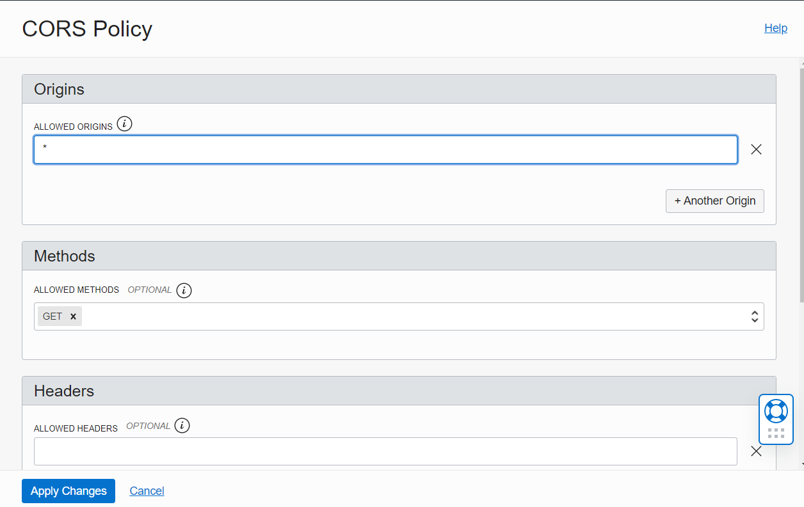

# Lab 2 - Developing Cloud Native Applications - Parte 1

Laboratory to show in practice how developer tools work in OCI.

## Objective

Create a Kubernetes application with the container images stored in the Oracle Container Registry (OCIR). The application's backend will be exposed via the API Gateway, where it will receive the CORS headers needed to communicate with the frontend.

In addition, the application will already have the necessary libraries and configurations to be monitored by APM, which will be demonstrated in lab 6.

- [Lab 2 - Developing Cloud Native Applications - Parte 1](#lab-2---developing-cloud-native-applications---parte-1)
  - [Objective](#objectivo)
  - [Information gathering](#information-gathering)
    - [Tenancy Namespace](#tenancy-namespace)
    - [User OCID & Auth Token](#user-ocid--auth-token)
    - [APM data](#apm-data)
    - [Region code](#region-code)
  - [Docker Login](#docker-login)
  - [Configuring Kubectl](#configuring-kubectl)
  - [Copy the Code](#copy-the-code)
  - [Configuring and Deploying the Backend](#configuring-and-deploying-the-backend)
    - [Docker Build](#docker-build)
    - [Docker Push](#docker-push)
    - [Creating Secrets in Kubernetes](#creating-secrets-in-kubernetes)
    - [Configuring the Kubernetes Manifest](#configuring-the-kubernetes-manifest)
    - [Deploy on Kubernetes](#deploy-on-kubernetes)
  - [API Gateway configuration](#api-gateway-configuration)
    - [Deployment](#deployment)
  - [Configure and Deploy the Frontend](#configure-and-deploy-the-frontend)
    - [Configuring the Frontend](#configuring-the-frontend)
    - [Docker Build Front](#docker-build-front)
    - [Docker Push Front](#docker-push-front)
    - [Configuring the Kubernetes Manifest](#configuring-the-kubernetes-manifest)
    - [Deploying Front on Kubernetes](#deploying-front-on-kubernetes)
  - [Testing the application](#testing-the-application)

## Information gathering

We are going to collect some information from the OCI tenancy that will be used throughout the laboratory, we recommend that you write it down on a notepad so that you always have it easily to hand. The following information will be collected:

```bash
Tenancy Namespace:
User Name:
Auth Token:
APM Endpoint:
Public Key:
Region code:
```

### Tenancy Namespace

Click on the user icon in the right-hand menu, then click on the name of your tenency.


Now copy the namespace into notepad.


### User OCID & Auth Token

Click on the user icon in the right-hand menu, then click on your user name.


Copy the user's OCID and save it in Notepad.

Then go to Auth Tokens and generate a new token, save the token in notepad.


### APM data

Navigate in the main menu to Observability & Management > Application Monitoring > Administration

Click on the domain created by Resource Manager in the previous lab, and copy the Endpoint and Public Key data.


### Region code

You can search for your region's code [here](https://docs.oracle.com/en-us/iaas/Content/Registry/Concepts/registryprerequisites.htm#regional-availability)

## Docker Login

We'll need Docker to build the application containers and push them to the OCIR. Before the push, we need to log in to the OCIR via dorcker-CLI.

Open the **Cloud Shell** and run the command below replacing the username, tenanacy ocid and region code. For the password, use the Auth Token you generated earlier.

```bash
docker login <Region Code>.ocir.io -u <tenancy-namespace>/<username>
```

Result:

```bash
password: <Auth Token>
WARNING! Your password will be stored unencrypted in /home/trial01oci/.docker/config.json.
Configure a credential helper to remove this warning. See
https://docs.docker.com/engine/reference/commandline/login/#credentials-store
```

## Configuring Kubectl

Now let's configure access to Kubernetes via Kubectl in the Cloud Shell, in the main menu go to **Developer Services > Containers & Artifacts > Kubernetes Clusters (OKE)**.

Enter the cluster created via Resource manager and click on the **Access Cluster** button.


Copy the command that appears in the popup and run it in the cloud shell.

Example:

```bash
$ oci ce cluster create-kubeconfig --cluster-id ocid1.cluster.oc1.sa-saopaulo-1.aaaaaaaan2pf --file $HOME/.kube/config --region sa-saopaulo-1 --token-version 2.0.0  --kube-endpoint PUBLIC_ENDPOINT

New config written to the Kubeconfig file /home/trial01oci/.kube/config

```

Access can be tested with the following command:

```bash
kubectl get nodes
```

You must have an answer similar to this:

```bash
NAME           STATUS   ROLES   AGE     VERSION
10.20.10.125   Ready    node    3h23m   v1.21.5
10.20.10.138   Ready    node    3h23m   v1.21.5
10.20.10.208   Ready    node    3h23m   v1.21.5
```

## Copy the Code

Open the Cloud Shell and run the git clone of the application code:

```bash
git clone https://github.com/ChristoPedro/labcodeappdev.git 
```

## Configuring and Deploying the Backend

Navigate to the backend folder:

```bash
cd labcodeappdev/Backend/code
```

Let's build the backend image and then push it to the OCIR.

### Docker Build

Run the command:

```bash
docker build -t <Region Code>.ocir.io/<tenancy-namespace>/ftdeveloper/back .
```

### Docker Push

After the Build we'll push to OCIR

```bash
docker push <Region Code>.ocir.io/<tenancy-namespace>/ftdeveloper/back
```

### Creating Secrets in Kubernetes

Let's create a secret that will contain the OCIR login information. This will allow the images to be pulled.

Just run this code, replacing the values

```bash
kubectl create secret docker-registry ocisecret --docker-server=<region-key>.ocir.io --docker-username='<tenancy-namespace>/<oci-username>' --docker-password='<oci-auth-token>' --docker-email='<email-address>'
````

Answer:

```bash
secret/ocisecret created
```

### Configuring the Kubernetes Manifest

Now let's go back one folder:

```bash
cd ..
```

Edit the code to add the APM and image parameters:

```bash
vi Deploybackend.yaml
```

Press **i** to edit.

Replace the values for **Image-Name**, **APM Endpoint** and **APM Key** in the following lines:

```note
Image-Name = <Region Code>.ocir.io/<tenancy-namespace>/ftdeveloper/back
```

```yaml
      - name: backend
        image: [Image-Name]:latest
        imagePullPolicy: Always
        ports:
        - containerPort: 5000
        env:
        - name: APM_URL
          value: "[Replace with APM Endpoint]"
        - name: APM_KEY
          value: "[Replace with APM Public Key]"
```

After replacing the values, use the following command **ESC : WQ** and press Enter.

### Deploy on Kubernetes

With the file edited, we can execute the following command to perform the deployment:

```bash
kubectl apply -f Deploybackend.yaml
```

You should get an output like the following:

```bash
deployment.apps/cepapp-backend created
service/cepapp-backend created
```

We can use the following code to find out if the pods are already on air:

```bash
kubectl get pods
```

## API Gateway configuration

First we need to find out the IP of the **Load Balancer** of the backend service.

```bash
kubectl get svc cepapp-backend
```

The answer will be something like this:
```bash
NAME             TYPE           CLUSTER-IP      EXTERNAL-IP    PORT(S)          AGE
cepapp-backend   LoadBalancer   10.96.123.143   10.20.20.237   5000:31952/TCP   13m
```

We're going to use EXTERNAL-IP to expose it via the **API Gateway**.

Now let's navigate to the main menu **Developer Services > API Management > Gateways**. And select the gateway already created by Resource Manager. In the left-hand menu, go to Deploymets.


And now we're going to create a new deployment, which will contain the backend route that will be consumed by the frontend.

### Deployment

Fill in the basic information with the following data:

- **Name**: backend
- **PATH PREFIX**: /cep
- **Compartment**: Select your compartment.


Now let's fill in the **CORS** information, without it we'll have errors in the calls between the Frontend and the Backend.

In the CORS area, click on the add button and fill in the following fields:

- **ALLOWED ORIGINS**: *
- **Methods**: GET

And apply the changes.



With CORS configured, we can click on **Next** and configure the route. Let's fill in the Route1 fields as follows:

- **PATH**: /getcep
- **METHODS**: GET
- **TYPE**: HTTP
- **URL**: ```http://[External-IP-LoadBalancer]:5000```


Once filled in, click on **Next** and then **Create**.

When the Deployment has been created, copy the URL of the endpoint and test the route.


Just throw the endpoint into the browser, in the following format:

```bash
<your_endpoint>/getcep?cep=<zip-code-of-your-home>
```


## Configure and Deploy the Frontend

For the Frontend, we need to replace the backend URL and APM information before building Docker.

### Configuring the Frontend

Let's navigate to the javascript folder:

```bash
cd $HOME/labcodeappdev/Frontend/code/js
```

And edit the **api.js** file

```bash
vi api.js
```

Let's replace the url variable.

```js
const url = '[Replace with the API Gateway URL]'
```

To do this, press **i** to edit the file and replace the information inside the quotation marks.

Example:

```js
const url = 'https://ghstpnks2qut3htj2w7zmdtghi.apigateway.sa-saopaulo-1.oci.customer-oci.com/cep/getcep'
```

To save, use the **ESC : WQ** keys.

Now we need to configure APM in HTML, let's go back a folder:

```bash
cd ..
```

And edit the **index.html** file:

```bash
vi index.html
```

And replace the values in the following lines:

```html
<script>
  window.apmrum = (window.apmrum || {}); 
  window.apmrum.serviceName='CEP';
  window.apmrum.webApplication='cepapp';
  window.apmrum.ociDataUploadEndpoint='[Replace with APM Endpoint]';
  window.apmrum.OracleAPMPublicDataKey='[Replace with the APM Public Key]';
</script>
<script async crossorigin="anonymous" src="[Replace with APM Endpoint]/static/jslib/apmrum.min.js"></script>
```

Save the file.

### Docker Build Front

After configuring the frontend, let's build docker with the following command.

```bash
docker build -t <Region Code>.ocir.io/<tenancy-namespace>/ftdeveloper/front .
```

### Docker Push Front

At the end of the build we can push to the OCIR

```bash
docker push <Region Code>.ocir.io/<tenancy-namespace>/ftdeveloper/front
```

### Configuring the Kubernetes Manifest

Now we need to go back one more folder:

```bash
cd ..
```

And edit the Deployfrontend.yaml file:

```bash
vi Deployfrontend.yaml
```

 Press **i** to edit the file, and replace the **Image-Name**:

 ```note
Image-Name = <Region Code>.ocir.io/<tenancy-namespace>/ftdeveloper/front
```

 ```yaml
     spec:
      containers:
      - name: front
        image: [Image-Name]:latest
        imagePullPolicy: Always
        ports:
        - containerPort: 80
      imagePullSecrets:
```

After the change, save the file with **ESC : WQ**.

### Deploying Front on Kubernetes

Now let's deploy the frontend to Kubernetes with the following command:

```bash
kubectl apply -f Deployfrontend.yaml
```

Output:

```bash
deployment.apps/cepapp-front created
service/cepapp-front created
```

## Testing the application

Now that the frontend and backend have been deployed, we can test the application.

Let's get the IP of the Frontend Load Balancer to access the application:

```bash
kubectl get svc cepapp-front
```

Obtaining a result similar to this:

```bash
NAME           TYPE           CLUSTER-IP     EXTERNAL-IP      PORT(S)        AGE
cepapp-front   LoadBalancer   10.96.188.10   152.70.213.248   80:31117/TCP   89s
```

Simply copy the external IP into the browser and test whether the application returns the information.


