## Lab 1 - Preparing our environment with Resource Manager
In this lab we will prepare the basic infrastructure for the workshop, where we will create the following services:

 - **Compartment:** Logical separation of resources within the cloud. The compartment plays a fundamental role in controlling access policies, governance and costs within the tenancy:[https://docs.oracle.com/pt-br/iaas/Content/Identity/Tasks/managingcompartments.htm](https://docs.oracle.com/pt-br/iaas/Content/Identity/Tasks/managingcompartments.htm)
 - **Resource Manager Stack:** Stack of terraform code that will be used in the workshop:[https://docs.oracle.com/pt-br/iaas/Content/ResourceManager/Concepts/resourcemanager.htm](https://docs.oracle.com/pt-br/iaas/Content/ResourceManager/Concepts/resourcemanager.htm)
 - **Dynamic Groups:** Dynamic groups allow you to group Oracle Cloud Infrastructure compute instances as "main" actors (similar to user groups):[https://docs.oracle.com/pt-br/iaas/Content/Identity/Tasks/managingdynamicgroups.htm](https://docs.oracle.com/pt-br/iaas/Content/Identity/Tasks/managingdynamicgroups.htm)
 - **Access Policies:** [https://docs.oracle.com/pt-br/iaas/Content/Identity/Concepts/policygetstarted.htm](https://docs.oracle.com/pt-br/iaas/Content/Identity/Concepts/policygetstarted.htm)
 - **Virtual Cloud Network**:[https://docs.oracle.com/pt-br/iaas/Content/Rover/Network/VCN/vcn_management.htm#VCNManagement](https://docs.oracle.com/pt-br/iaas/Content/Rover/Network/VCN/vcn_management.htm#VCNManagement)
 - **OCI Streaming Service:** Streaming service compatible with the Kafka model (publish - subscribe)[https://docs.oracle.com/pt-br/iaas/Content/Streaming/Concepts/streamingoverview.htm](https://docs.oracle.com/pt-br/iaas/Content/Streaming/Concepts/streamingoverview.htm)
 - **Object Storage:** [https://docs.oracle.com/pt-br/iaas/Content/Object/Concepts/objectstorageoverview.htm#Overview_of_Object_Storage](https://docs.oracle.com/pt-br/iaas/Content/Object/Concepts/objectstorageoverview.htm#Overview_of_Object_Storage)
 - **Container Registry:** Container registry similar to Docker Hub.[https://docs.oracle.com/pt-br/iaas/Content/Registry/Concepts/registryoverview.htm](https://docs.oracle.com/pt-br/iaas/Content/Registry/Concepts/registryoverview.htm)
 
#### Creating the compartment
1. Access the cloud console: [https://www.oracle.com/cloud/sign-in.html](https://www.oracle.com/cloud/sign-in.html)

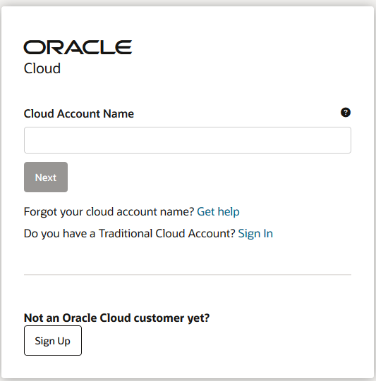

2. Enter the name of your tenancy in the **Cloud Account Name** field.

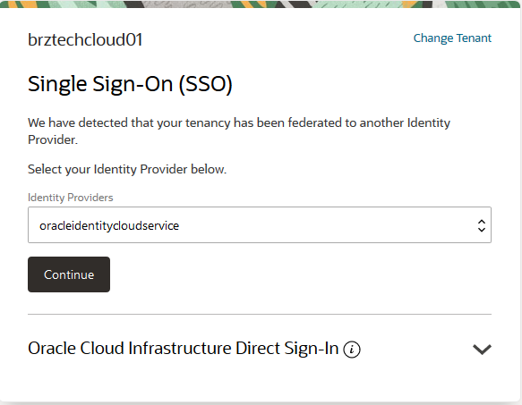

3. Click on the **Continue** button to go to the login page.

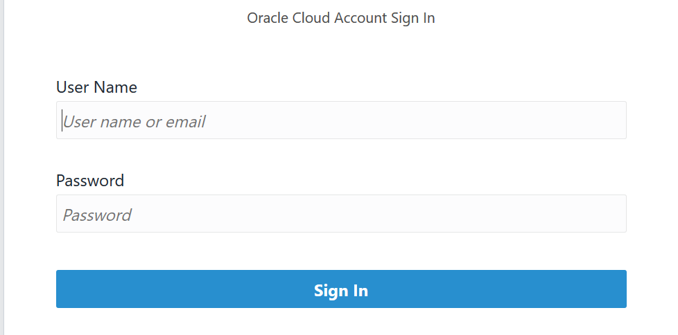

4. Enter your username/password and click on **Sing In**

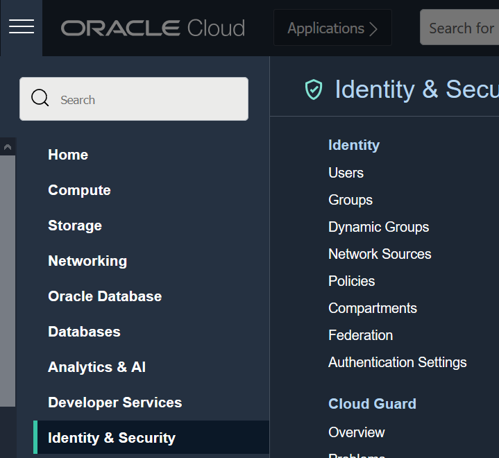

5. Go to the **menu in the top left-hand corner**, under **Identity & Security**, click on **Compartments**.

6. Click on Create Compartment.

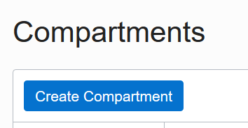

7. Fill in the following fields:

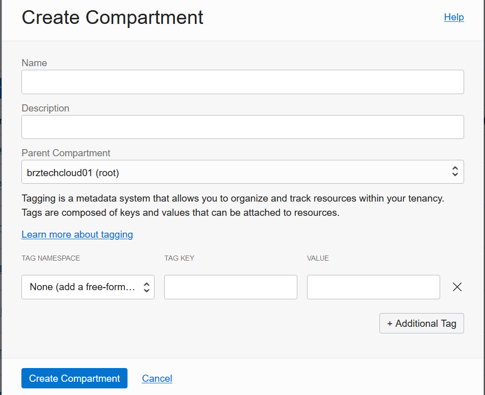

- **Name:** < Define a name for the compartment >
- **Description:** < Define a description for the compartment >
- **Parent Compartment:** Select the compartment marked as **(root)**.
8. Click on **Create Compartment**
9. Wait a short while, then refresh the browser page so that the change is reflected.
#### Collecting the necessary information
10. Select the newly created compartment

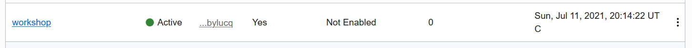

11. On the compartment page, copy the **Name** and **OCID** information into a notebook.

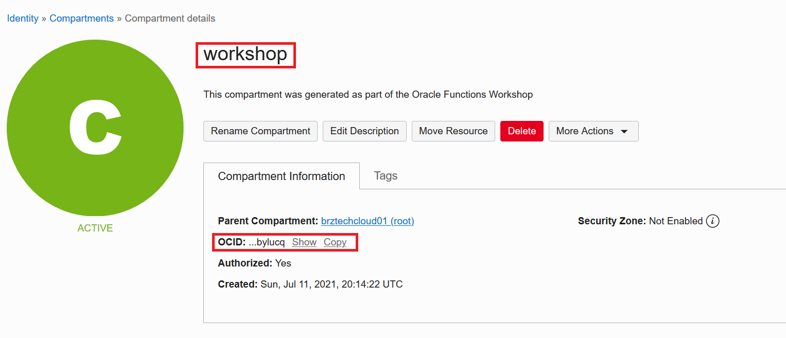

#### Creating the Apply Stack and Job
12. Access the menu in the top left-hand corner, under **Developer Services**, click on **Stacks**.

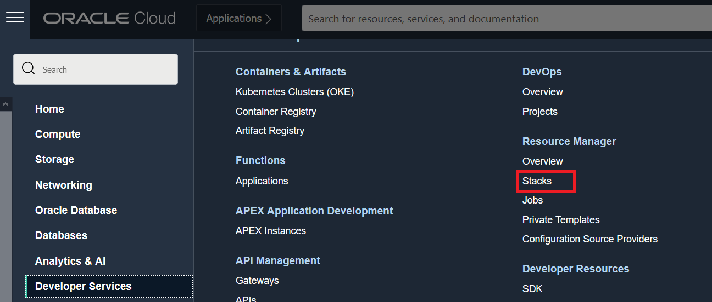

13. In the bottom left-hand corner, under List Scope, select the compartment you just created. *If the compartment is not listed, simply refresh the browser page.

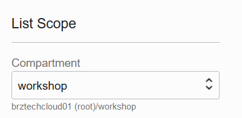

14. Download](https://github.com/gustavogaspar/events-function/raw/main/terraform.zip) the configuration ".zip" containing the terraform manifest (you don't need to extract the file). 
15. Click on **Create Stack** (Create Stack)

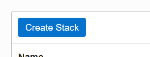

16. Fill in the form below:

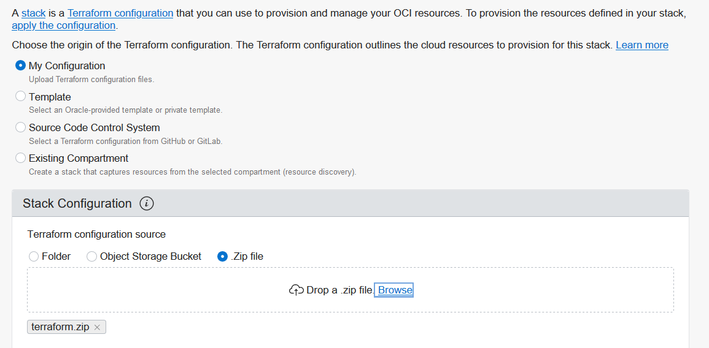

- Select **My Configuration** (My Configuration)
- Under Stack Configuration, select .zip file and upload the .zip configuration collected in step 14 of this guide.
17. Click on **Next**.
18. Fill in the form with the following information:

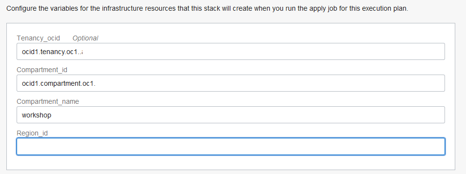

- Tenancy_ocid: (**Keep value shown**)
- Compartment_id: Fill in the **OCID** information collected in step **11**
- Compartment_name: Fill in the **Name** information collected in step **11**
- Region_key: This field must be filled in with the lowercase key for your **region**. To find out the key for your region, use the **Region Key** column in the list of regions on the link: [https://docs.oracle.com/en-us/iaas/Content/General/Concepts/regions.htm](https://docs.oracle.com/en-us/iaas/Content/General/Concepts/regions.htm).
19. Click on **Next**.
20. Select the **Run Apply** checkbox and click **Create**.

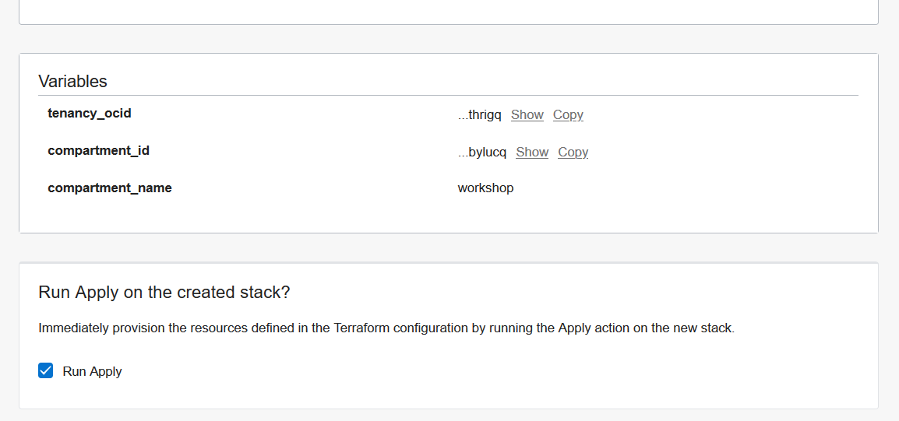

21. Wait for it to finish and go to the next lab.

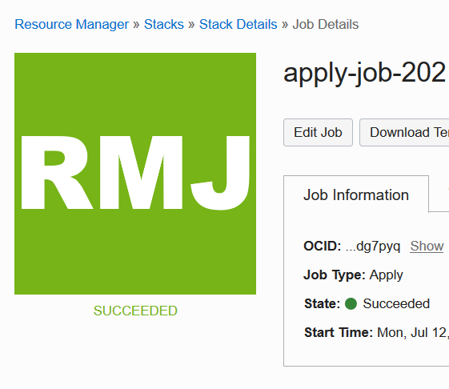

[<--------RETURN](../README.md)         

[CONTINUE-------->](../LAB02/README.md)

