## Creating your Function and configuring the Cloud Shell environment

 In this lab we will create our first application on the functions platform, where we will deploy the function responsible for collecting and sending the contents of a file to object storage. We will also use the Cloud Shell feature to manage/test our function.
 For this task we will use the following resources:
 
 - **Oracle Functions:** [https://docs.oracle.com/pt-br/iaas/Content/Functions/Concepts/functionshowitworks.htm](https://docs.oracle.com/pt-br/iaas/Content/Functions/Concepts/functionshowitworks.htm)
 - **Cloud Shell:** [https://docs.oracle.com/pt-br/iaas/Content/API/Concepts/cloudshellintro.htm](https://docs.oracle.com/pt-br/iaas/Content/API/Concepts/cloudshellintro.htm)
 

#### Collecting Necessary Information
1. In the top right-hand corner, click on **profile icon**, then select **your user**, as shown in the image below:

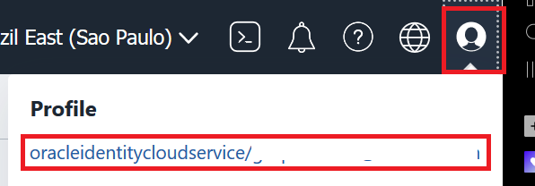

2. In the bottom left-hand corner, under **Resources**, select **Auth Tokens**

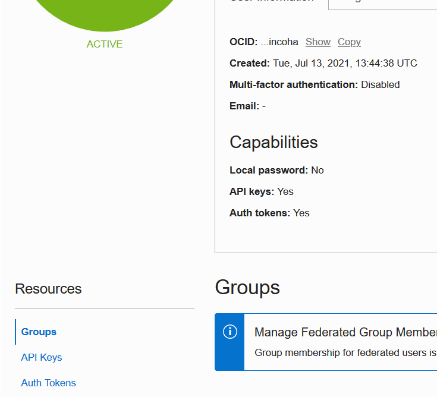

3. Click on Generate Token.

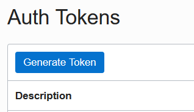

4. Type in a description of your choice for the token and click on Generate Token.

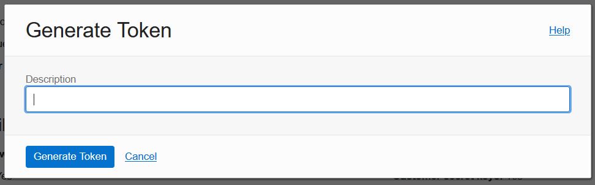

5. **Copy the generated token to a notepad, this token will not be shown again.

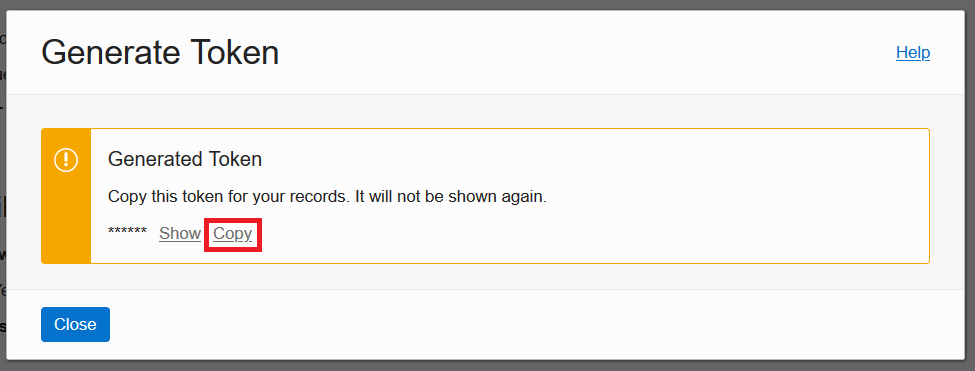

6. Click on Close.

#### Creating the Function Application
7. Open the menu in the top left-hand corner, under **Developer Services**, select **Functions**.

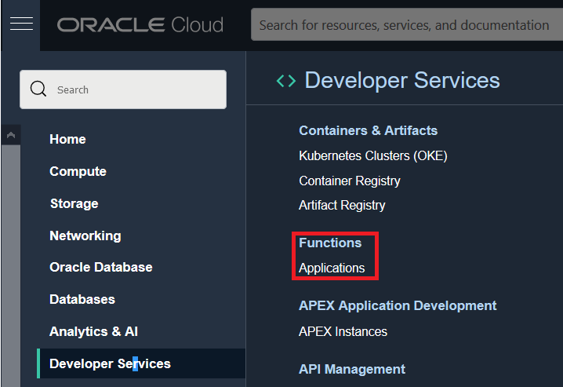

8. In the bottom left-hand corner, check that the **compartment** you are using for this lab is selected.

9. Click on **Create Application**.

10. Fill in the New Application form:
- Name: < Define a name for your function >
- VCN: Select **vcn_workshop**
- Subnets: Select **subnet_workshop**

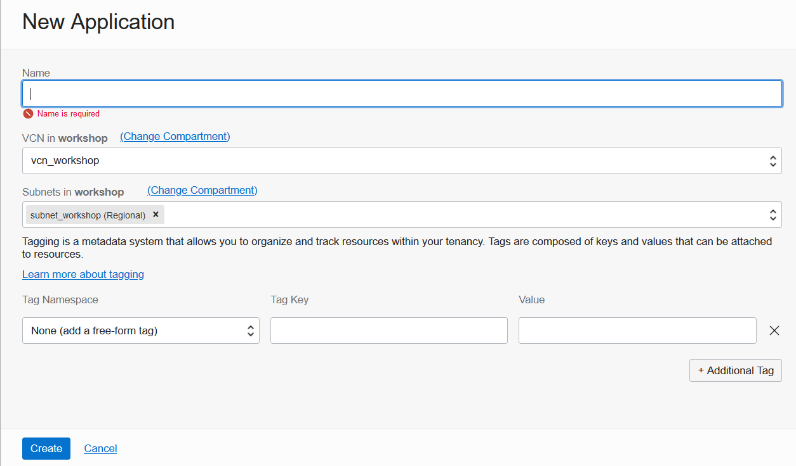

11. Click on **Create**.
#### Configuring the Cloud Shell Environment
12. On the application page created, follow the guide generated by the platform itself to configure the cloud shell.
13. To access the guide, click on Getting Started in the bottom left-hand corner.

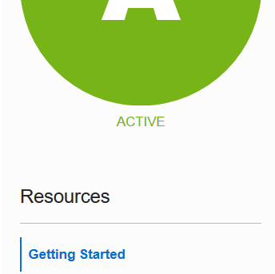

14. Select the Cloud Shell Setup option.

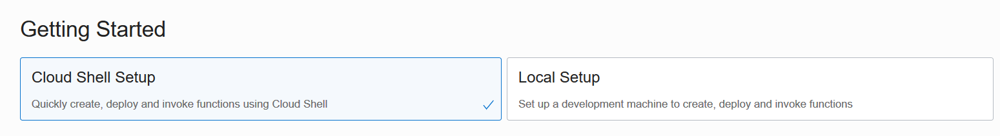

15. Carry out steps **1,2 and 3** of the guide without any changes:

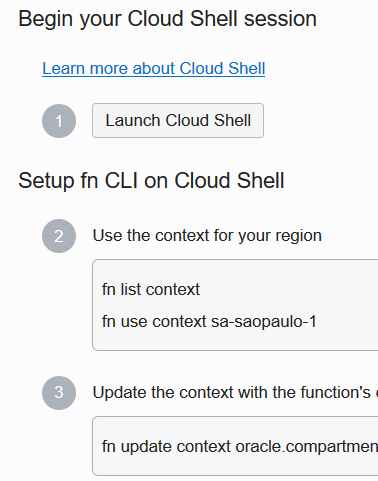

16. Run step **4** replacing **[OCIR-REPO]** with **workshop** as per the example below:

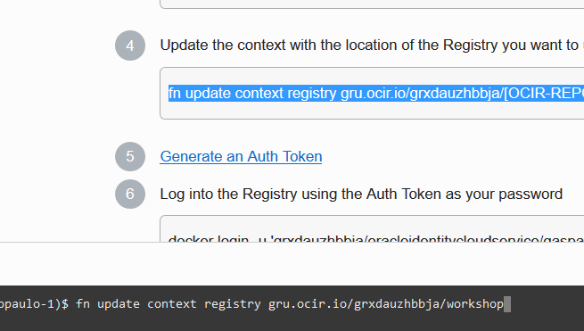

17. We will skip step **5** as we have already generated the Auth token previously.
18. Run step **6**, and when asked for **password** information, enter the **Auth Token information generated in step 3 of this lab**.

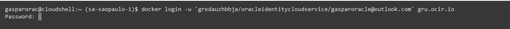

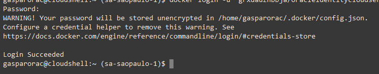

19. Perform step **7** to validate that the configuration was successful.

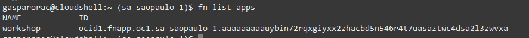

#### Deploying the Function
 20. Still using Cloud Shell, clone the repository of the function we're going to use in this workshop:
 

    $ git clone https://github.com/gustavogaspar/events-function.git

 21. Enter the project folder
 

    $ cd events-function

22. Run the deploy command, replacing the **[APP-NAME]** information with the **name of your application created in step 11 of this lab**. (You can use the command presented in step 10 of the Getting Started tab. This process can take a long time.

   $ fn -v deploy --app [APP-NAME]

23. Run the command below to call the function and validate that it was created correctly: 

   $ fn invoke [APP-NAME] final-workshop

24. The expected return is: **{"message":"No event"}**

[<--------RETURN](../LAB01/README.md) 

[CONTINUE WITH LAB 3-------->](../LAB03/README.md)

