## Creating the Event Rule and testing how the flow works

In this lab we will create our rule that will map creation events in our object storage, and activate the function we created in the previous lab.
For this task we will use the following resources:
 
 - **Oracle Events:** [https://docs.oracle.com/pt-br/iaas/Content/Events/Concepts/eventsoverview.htm](https://docs.oracle.com/pt-br/iaas/Content/Events/Concepts/eventsoverview.htm)

#### Creating an event rule
1. Access the menu in the top left-hand corner, under **Observability & Management**, click on **Events Service**.

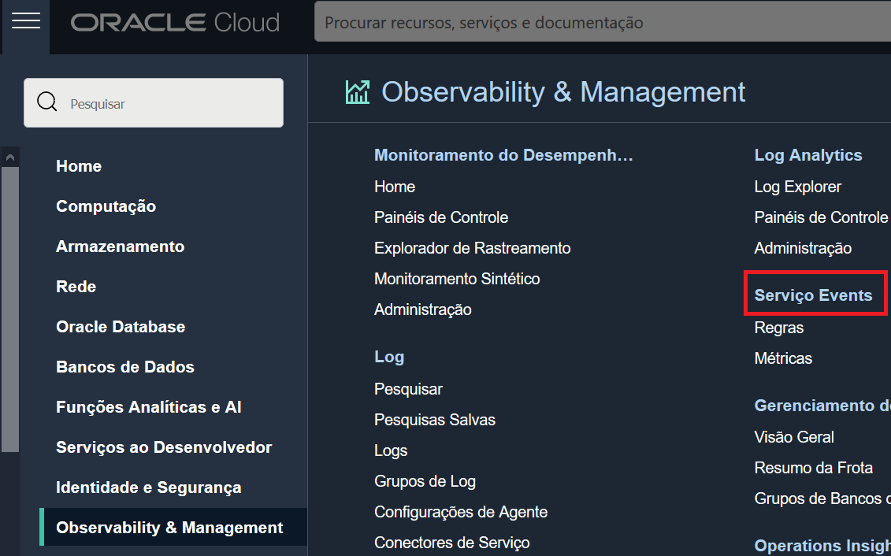

2. In the bottom left-hand corner, check that the **compartment** you are using for this lab is selected.

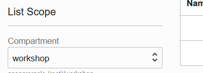

3. Click on **Create Rule**.

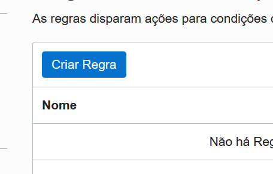

4. Fill in the rule form as follows:
- **Display Name:** < Define a rule name >
- **Description:** < Define a description for the rule >
- **Rule Conditions:**
- **Condition:** "Event Type"
- **Service Name:** "Object Storage"
- **Event Type:** "Object Create"

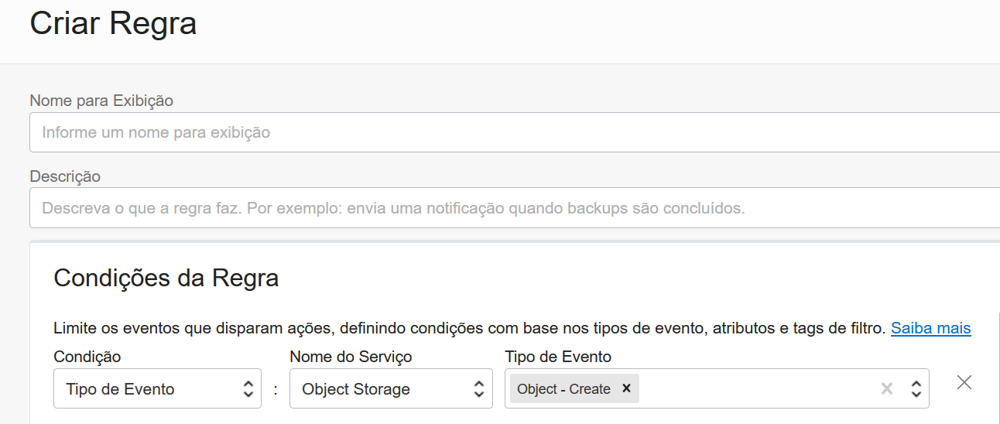

- **Actions:**
- **Action Type:** "Functions"
- **Function compartment:** < Select the compartment of the function created in the previous lab>
- **Function Application:** < Select the function application created in the previous lab>
- **Function:** "final-workshop"

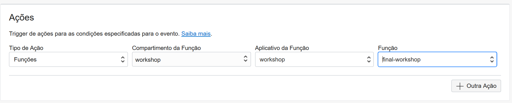

5. Click on **Create**.

#### Testing the flow

Now that we have the flow created, we can test its functionality. To do this, we will open a new tab in the browser, where we will access our stream, and in our main tab we will test the creation of a **.txt** file in our bucket.

##### New Tab
1. Access the cloud console: [https://www.oracle.com/cloud/sign-in.html](https://www.oracle.com/cloud/sign-in.html)
2. Enter the name of your tenancy in the **Cloud Account Name** field.
3. Click on the **Continue** button to go to the login page.
4. Enter your username/password and click on **Sing In** *(If your browser already has an active session, this step probably won't be necessary)*
5. In the menu in the top left-hand corner, under Analytics & AI, select Messaging.

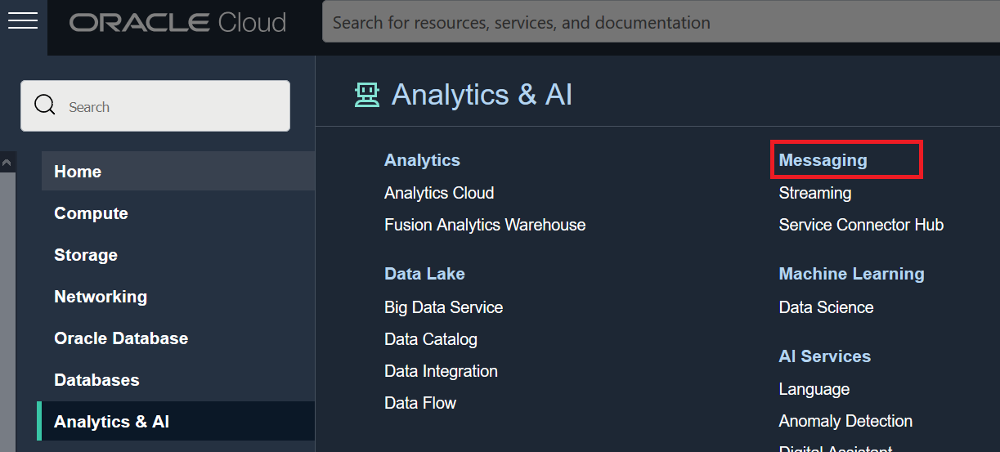

6. In the bottom left-hand corner, check that the **compartment** you are using for this lab is selected.

7. You will notice that a stream has already been created in this compartment with the name **"workshop"** . *This stream was created during the first lab, where we ran the terraform code through the resource manager.

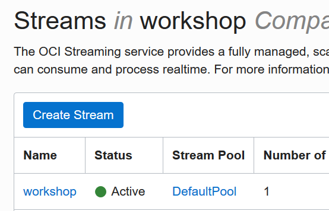

8. Select the **"workshop"** flow
9. **Keep the tab open,** and return to your browser's main tab.

 ##### Main Tab
 1. In the menu in the top left-hand corner, under **Storage**, go to **Buckets**
 
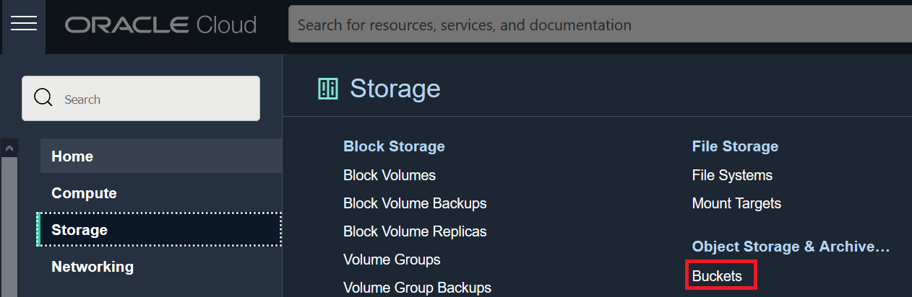

 2. In the bottom left-hand corner, check that the **compartment** you are using for this lab is selected.
 

 3. You will notice that a **Bucket** has already been created in this compartment with the name **"workshop_bucket"**.
 
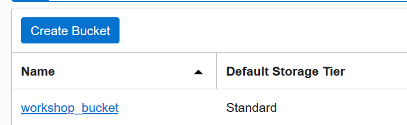

 4. Select the **"workshop_bucket"** bucket.
 5. Emitting events from a bucket is optional and can be enabled or disabled at any time. Validate that **emission of events** (Emit Object Events) is enabled for this bucket.
 
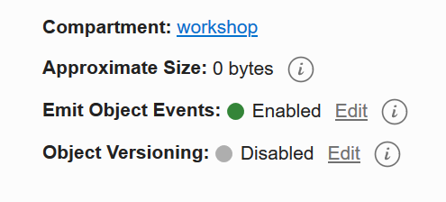

 6. We're ready to run the test, keep the main tab open.

##### Test

1. Create a **.txt** file on your local computer with the content of your choice.  *(The .txt utf-8 format is not mandatory, but all the tests carried out in this workshop have taken this format into account)*

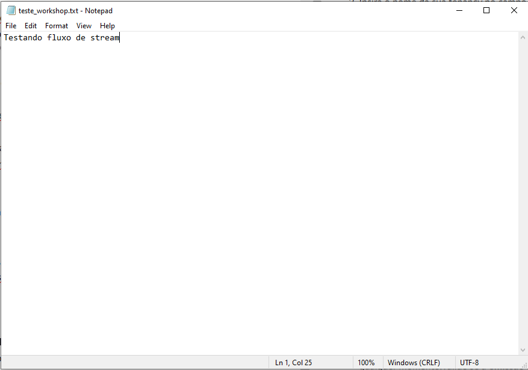

2. In your **main tab** (where we have the Bucket page "workshop_bucket" open) click on **Upload**.

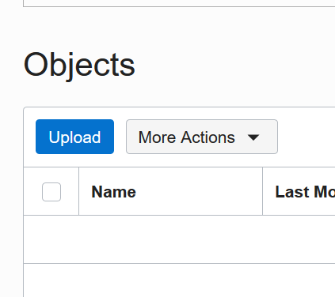

3. On the object upload form, click on **select files** (select files)

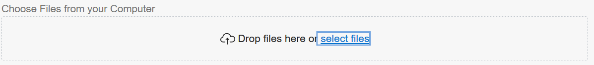

4. Select the **.txt** file created for this test
5. Click on **Upload**

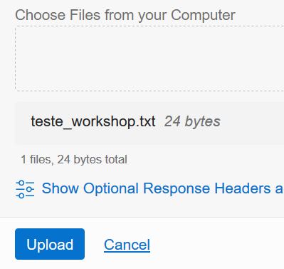

6. **Finish uploading the file and click Close.
7. **In the new tab (where the workshop flow page is open) click on Load Messages. 

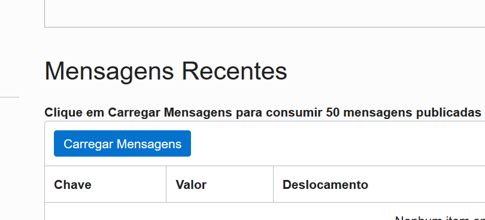

8. Don't worry if no items have been found, this process can take some time as it's the first time the function is run. Wait a few seconds and try loading the messages again if necessary.

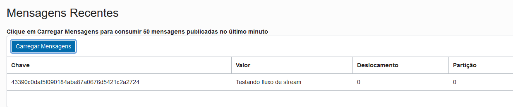

[<--------RETURN TO LAB02](../LAB02/README.md)

