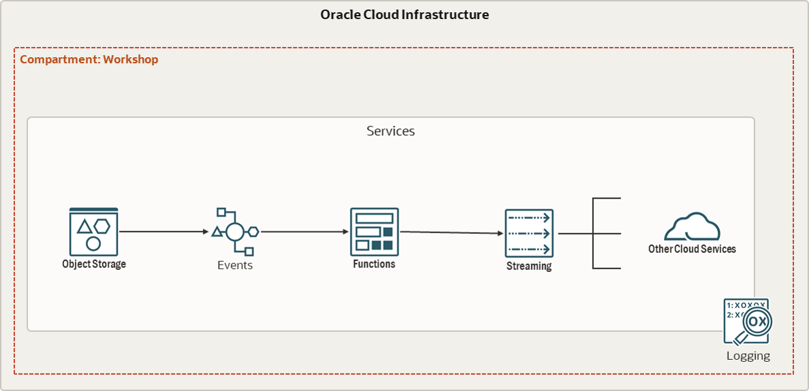

# Lab. #3 - Developing Cloud Native Applications - Parte 2

This workshop was developed to demonstrate the functionalities of Oracle Cloud Infrastructure in scenarios where it is necessary to orchestrate your infrastructure based on Events. The ultimate goal of this workshop is to create and implement the following event flow:

- 🌀 [Oracle Functions official website](https://www.oracle.com/br/cloud-native/functions/)
- 🧾 [Oracle Functions Documentation](https://docs.oracle.com/en-us/iaas/Content/Functions/Concepts/functionsoverview.htm)

- 🌀 [Oracle Events official website](https://www.oracle.com/br/cloud-native/events-service/)
- 🧾 [Oracle Events documentation](https://docs.oracle.com/en-us/iaas/Content/Events/Concepts/eventsoverview.htm)

- 🌀 [Oracle Streaming official page](https://www.oracle.com/br/cloud-native/streaming/)
- 🧾 [Oracle Streaming documentation](https://docs.oracle.com/en-us/iaas/Content/Streaming/Concepts/streamingoverview.htm)

- [LAB 01 - Preparing the Environment](./LAB01/README.md)
- [LAB 02 - Functions](./LAB02/README.md)
- [LAB 03 - Events](./LAB03/README.md)
